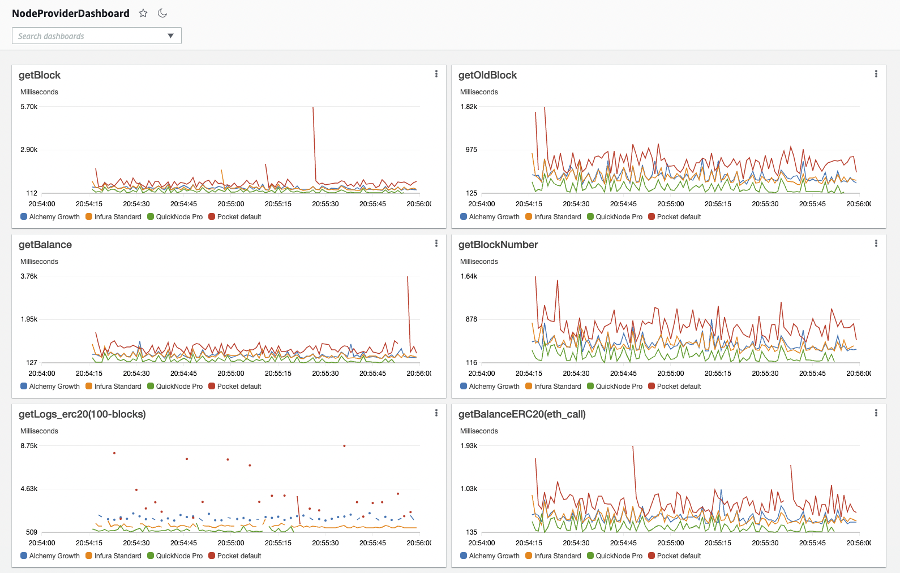

# Quick script to run benchmarking on various RPC calls on all the providers

To run the test suite: 
``` 
npm install
npm run start
```

## Customizing for your own test suite
If you want to test different providers see: [`src/providers/index.ts`](src/providers/index.ts)

If you want to run different queries/tests, make changes to: [`src/benchmarks/index.ts`](src/benchmarks/index.ts)
For example: 
``` typescript
runTestAndReport(
    providerMetadata,
    DEFAULT_ITERATIONS,
    '<<<insert your custom test name>>>',
    () => <<<insert a promise here to benchmark>>>,
),
```
To get the results to show up in the AWS dashboard for the new test, you need to add the test name to the widgets array in [`src/dashboard.ts`](src/dashboard.ts)

## Set up your providers
Create a .env file with all your API access keys. This should match all the providers you are benmchmarking in  [`src/providers/index.ts`](src/providers/index.ts)
``` bash
ALCHEMY_API_KEY=<<<YOUR ALCHEMY API KEY>>>
INFURA_URL=<<<INFURA URL>>>
QUICKNODE_URL=<<<Quicknode url>>>
POCKET_URL=<<<YOUR POCKET PROJECT URL>>>
MORALIS_URL=<<<YOUR MORALIS URL>>>
MORALIS_ARCH_URL=<<<YOUR MORALIS ARCHIVE URL>>>
# add any others here, and update the providers list in src/providers/index.ts with the env key
```

## Dashboards
The framework by default reports all metrics to file in [out/report.txt](out/report.txt) and also attempts to write the metrics to AWS cloudwatch (they give nice graphing tools to us for free). 
To view all of the metrics in 1 place on AWS, there is the CloudWatch Dashboard feature. There is a script in this package to generate the configuration file for the dashboard. Just make sure [`src/dashboard.ts`](src/dashboard.ts) is up to date with your tests then run 

So any time a new test is added, and you want it to be reflected in the dashboard, make sure to update in 2 places with matching testName. 

1. create/update the test name itself [here](/src/benchmarks/index.ts#L91)
2. and add/update the test name in the dashboard generator list [here](src/dashboard.ts#L66)

Then generate the new dashboard: 
```
npm run generate-dashboard
```
which will output a JSON blob that you can copy/paste into the dashboard UI on AWS console.

AWS Cloudwatch -> Dashboards -> Create Dashboard -> Actions -> View/edit source -> Paste the generated JSON 




